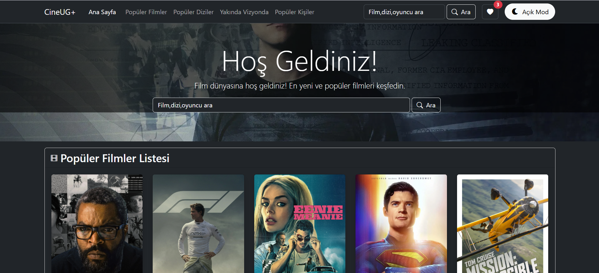
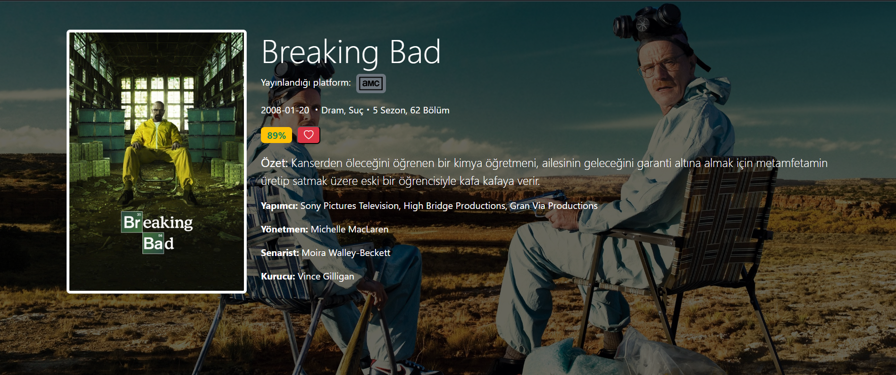
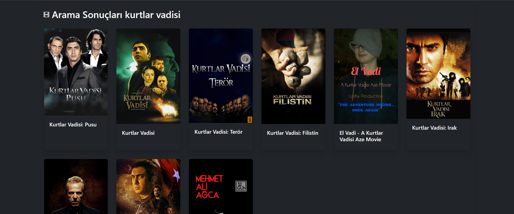

<div align="center">
  
  
  
  
</div>

<div align="center">
  <h1>🎬 CineUG+ - Ultimate Movie Discovery Platform</h1>
  <p><strong>Modern, responsive ve kullanıcı dostu film & dizi keşif uygulaması</strong></p>
  
  [](https://movie-app-react-sepia.vercel.app/)
  [](https://github.com/jardeux/reactmovieapp)
  [](LICENSE)
</div>

---

## ✨ Özellikler

### 🎯 **Ana Özellikler**

- 🎬 **Film & Dizi Keşfi**: TMDB API ile güncel içerik
- 🔍 **Gelişmiş Arama**: Film, dizi ve kişi arama
- 📱 **Responsive Tasarım**: Tüm cihazlarda mükemmel görünüm
- 🌙 **Dark/Light Tema**: Kullanıcı tercihine göre tema değişimi
- 👥 **Kullanıcı Sistemi**: Kayıt, giriş ve profil yönetimi
- 📋 **İzleme Listesi**: Kişiselleştirilmiş film listesi

### 🚀 **Teknik Özellikler**

- ⚡ **Vite Build**: Ultra hızlı geliştirme ve build
- 🎨 **Modern UI/UX**: Bootstrap 5 ile şık tasarım
- 🔒 **Güvenli API**: Environment variables ile korumalı
- 🧠 **State Management**: React Context API
- 🛣️ **Routing**: React Router v7 ile SPA
- 📱 **PWA Ready**: Progressive Web App desteği

---

## 🖼️ Ekran Görüntüleri

<div align="center">
  
  
  
</div>

---

## 🛠️ Teknoloji Stack

### **Frontend Framework**

- **React 19.1.1** - Modern React with latest features
- **Vite 7.1.2** - Lightning fast build tool
- **React Router 7.8.2** - Client-side routing

### **Styling & UI**

- **Bootstrap 5.3.7** - Responsive CSS framework
- **Bootstrap Icons 1.13.1** - Beautiful icon library
- **Custom CSS** - Tailored design system

### **Development Tools**

- **ESLint** - Code quality & consistency
- **TypeScript Support** - Type safety & IntelliSense
- **Hot Module Replacement** - Instant development feedback

---

## 🚀 Kurulum

### **Gereksinimler**

- Node.js 18+
- npm v9+ veya yarn

### **Adım 1: Projeyi Klonlayın**

```bash
git clone https://github.com/jardeux/MovieAppReact.git
cd movieapp
```

### **Adım 2: Bağımlılıkları Yükleyin**

```bash
npm install
# veya
yarn install
```

### **Adım 3: Environment Variables**

`.env` dosyası oluşturun:

```env
VITE_TMDB_API_KEY=your_tmdb_api_key_here
VITE_TMDB_BASE_URL=https://api.themoviedb.org/3
```

### **Adım 4: Geliştirme Sunucusunu Başlatın**

```bash
npm run dev
# veya
yarn dev
```

Uygulama [http://localhost:5173](http://localhost:5173) adresinde açılacak!

---

## 📱 Kullanım

### **Ana Sayfa**

- Popüler filmler ve diziler
- Güncel yayınlar
- Hızlı arama

### **Film/Dizi Detayları**

- Detaylı bilgiler
- Oyuncu kadrosu
- Benzer içerikler
- İzleme listesine ekleme

### **Kullanıcı Paneli**

- Kişisel izleme listesi
- Tema tercihi

---

## 🏗️ Proje Yapısı

```
src/
├── components/          # Yeniden kullanılabilir bileşenler
│   ├── Movie.jsx       # Film kartı
│   ├── Navbar.jsx      # Navigasyon
│   ├── SearchForm.jsx  # Arama formu
│   └── ThemeChange.jsx # Tema değiştirici
├── pages/              # Sayfa bileşenleri
│   ├── Home.jsx        # Ana sayfa
│   ├── MovieDetails.jsx # Film detayları
│   ├── SearchResults.jsx # Arama sonuçları
│   └── WatchList.jsx   # İzleme listesi
├── contexts/           # React Context'ler
│   ├── ThemeContext.jsx # Tema yönetimi
│   └── UserContext.jsx # Kullanıcı yönetimi
├── layouts/            # Sayfa düzenleri
│   └── MainLayout.jsx  # Ana layout
└── utils/              # Yardımcı fonksiyonlar
    └── api.js         # API yapılandırması
```

---

## 🔌 API Entegrasyonu

### **TMDB API**

- **Film & Dizi Bilgileri**: Detaylı içerik bilgileri
- **Arama Sistemi**: Çoklu arama (film, dizi, kişi)
- **Popüler İçerikler**: Güncel trendler
- **Oyuncu Bilgileri**: Detaylı kişi profilleri

### **Güvenlik**

- Environment variables ile API key koruması
- Rate limiting desteği
- Error handling

---

## 🚀 Deployment

### **Vercel (Önerilen)**

1. Vercel hesabı oluşturun
2. GitHub repo'nuzu bağlayın
3. Environment variables ekleyin:
   - `VITE_TMDB_API_KEY`
   - `VITE_TMDB_BASE_URL`
4. Deploy edin!

### **Netlify**

1. Netlify hesabı oluşturun
2. GitHub repo'nuzu bağlayın
3. Build komutunu ayarlayın: `npm run build`
4. Publish directory: `dist`

---

## 🤝 Katkıda Bulunma

1. Fork edin
2. Feature branch oluşturun (`git checkout -b feature/AmazingFeature`)
3. Commit edin (`git commit -m 'Add some AmazingFeature'`)
4. Push edin (`git push origin feature/AmazingFeature`)
5. Pull Request oluşturun

---

## 📄 Lisans

Bu proje MIT lisansı altında lisanslanmıştır. Detaylar için [LICENSE](LICENSE) dosyasına bakın.

---

## 🙏 Teşekkürler

- [TMDB](https://www.themoviedb.org/) - Film veritabanı API'si
- [React](https://reactjs.org/) - UI kütüphanesi
- [Vite](https://vitejs.dev/) - Build tool
- [Bootstrap](https://getbootstrap.com/) - CSS framework

---

<div align="center">
  <p>⭐ Bu projeyi beğendiyseniz yıldız vermeyi unutmayın!</p>
  
  <a href="https://github.com/jardeux/MovieAppReact">
    
  </a>
  
  <a href="https://movie-app-react-sepia.vercel.app/">
    
  </a>
</div>

---

<div align="center">
  <sub>Made with ❤️ by jardeux</sub>
</div>
